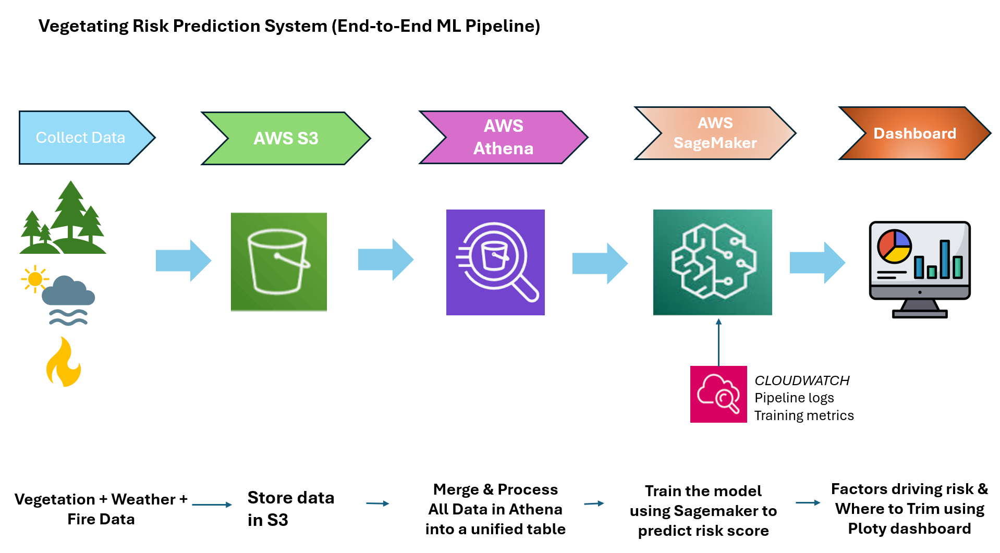

# 🌿 ADS-508 Final Project
## Predicting Vegetation Growth Risk for Tree Trimming Prioritization Using Machine Learning

 A machine learning system that identifies high-risk vegetation zones across California to support proactive wildfire prevention and smarter utility maintenance.

---

## 🔗 Links

| Resource | Link |
|---|---|

| 📄 Project Report | [View Report](document/Vegetation%20Management%20System.docx) |

| 📑 Executive Summary | [View PDF](document/Executive%20Summary%20Presentation-%20Team%208.pdf) |


---

## 📌 Problem Statement

Vegetation growing near power lines is a leading cause of wildfire risk in California. Current vegetation management relies on routine inspections and fixed trimming schedules which is reactive and inefficient. This project uses environmental, forestry, and wildfire data to predict high-risk zones and support proactive vegetation management decisions.

---


## 🗂️ Data Sources

> See [`data/raw/data_sources.md`](data/raw/data_sources.md) for download links and full source details. All raw data is stored in Amazon S3.

### Forest Inventory and Analysis (FIA)
- Tree characteristics (diameter, height, species)
- Terrain information (slope and aspect)
- Biomass measurements

### CAL FIRE Wildfire Dataset
- Historical wildfire incidents
- Fire size, location, and date

### NOAA Weather Data (via Meteostat)
- Temperature and precipitation
- Wind speed
- Atmospheric pressure

---

## 🛠️ Tools & Technologies

| Category | Tools |
|---|---|
| Cloud Storage | Amazon S3 |
| Data Prep | AWS Athena |
| Model Training | AWS SageMaker |
| Monitoring | AWS CloudWatch |
| Visualization | Plotly |
| ML / Data | Python, pandas, numpy, scikit-learn, XGBoost |
| Geospatial | Geopy |

---

## 🔁 Pipeline Overview

#### 🏗️ Architecture Diagram




Raw Data (S3) → Athena (join & query) → SageMaker (train + infer) → S3 (results) → Plotly Dashboard


### Methodology

1. **Data Ingestion** — Raw FIA, CAL FIRE, and NOAA datasets stored in Amazon S3 and loaded into SageMaker notebooks.

2. **Data Cleaning** — Removed missing values, standardized formats, and filtered invalid geographic points.

3. **Feature Engineering** — Created vegetation risk indicators:
   - `fuel_moisture_risk`
   - `fire_recurrence`
   - `log_fire_size`
   - Seasonal patterns encoded using sine/cosine transformations
  

4. **Data Splitting** — Stratified split: 70% training / 15% validation / 15% test.

5. **Model Training** — XGBoost (SageMaker built-in), multi-class classification (`multi:softprob`),which outputs probability scores for each class. These probabilities were used to generate:
   - Risk score (0–100)
   - Risk class (Low / Medium / High)

6. **Model Monitoring** — Training performance, log loss, and error metrics were tracked using Amazon CloudWatch to ensure the model was learning correctly and not overfitting.
   
6. **Batch Inference** — The full dataset was processed using SageMaker Batch Transform to generate predictions for over 243000 locations.

7. **Dashboard Preparation** — Derived fields such as risk_level, trimming_priority_score, is_high_risk, and seasonal features (fire_month, fire_month_name) were created. County and city information was added, and the final dataset was stored in S3 and locally for dashboard visualization.
---

## 🔍 Key Insights

- High-risk areas are not evenly distributed and are concentrated in specific regions
- Areas with high temperature, low rainfall, and dense vegetation show higher risk
- Locations with past wildfire history are more likely to experience future risk
- Fuel moisture risk is one of the strongest indicators of wildfire risk
- Many regions are low-risk, showing that not all areas need equal attention

## 📈 Results

- 98.8% model accuracy with strong F1-score across all priority classes
- Generated risk scores for 243K+ locations, covering 57/58 counties (~98%)
- High-risk vegetation zones identified for immediate trimming prioritization
- Built an interactive dashboard to visualize risk patterns across California

  
## 💼 Business Impact
- Enables data-driven trimming decisions instead of fixed schedules
- Reduces unnecessary operations and costs
- Supports proactive wildfire prevention
- Improves resource planning and efficiency
- Enhances infrastructure safety and reliability

---

## 🖥️ Dashboard Features

- Interactive map of California with risk-based visualization
- KPIs: High Risk Areas, % High Risk Coverage, Average Biomass, Total Plots Monitored
- Top 10 highest-risk counties ranking
- Risk distribution analysis and seasonal (monthly) analysis
- County and city-level filtering

---

## Running the Dashboard

### Prerequisites
- Python 3.8+
- pip

### Steps

```bash
# 1. Clone the repository
git clone https://github.com/your-org/ADS-508-Final-Project.git
cd ADS-508-Final-Project

# 2. Install dependencies
pip install -r requirements.txt

# 3. Launch the dashboard
python dashboard/app.py
```

Then open your browser and navigate to:

```
http://localhost:8050
```

> The dashboard reads from  the final predictions dataset. To regenerate predictions from scratch, run the full pipeline using `master_file.ipynb` or execute the notebooks step-by-step in the `notebooks/` folder
---

## 🏢 Target Users

### ⚡ Electric Utilities
Companies like Pacific Gas & Electric, Southern California Edison, and San Diego Gas & Electric can use this tool to identify high-risk zones before they become wildfire hazards and optimize trimming crew deployment.

### 🔥 Government Agencies
CAL FIRE and county agencies can leverage predictive risk scores for regional fire preparedness and resource allocation.

### 🏘️ HOAs & Property Management
Homeowners Associations and property management companies can monitor vegetation risk in residential communities and reduce fire exposure near homes and shared spaces.

---

## 🔮 Future Work

- Enable real-time predictions:
Move from batch processing to real-time risk scoring using live weather data. This will help detect high-risk conditions instantly and support faster decision-making during critical situations.

- Integrate additional data sources:
Include satellite imagery (NDVI), soil moisture, and infrastructure data. This will improve model accuracy and provide a more complete understanding of vegetation and wildfire risk.

- Implement automated alerts:
Set risk thresholds to trigger email or SMS notifications. This allows utility teams to take immediate action when vegetation risk becomes high.

- Improve geospatial accuracy & model performance:
Use advanced spatial joins for better location mapping and apply hyperparameter tuning to improve generalization and reduce overfitting.
---


*University of San Diego — ADS 508 Final Project · Built on AWS · XGBoost · Plotly · Python*
